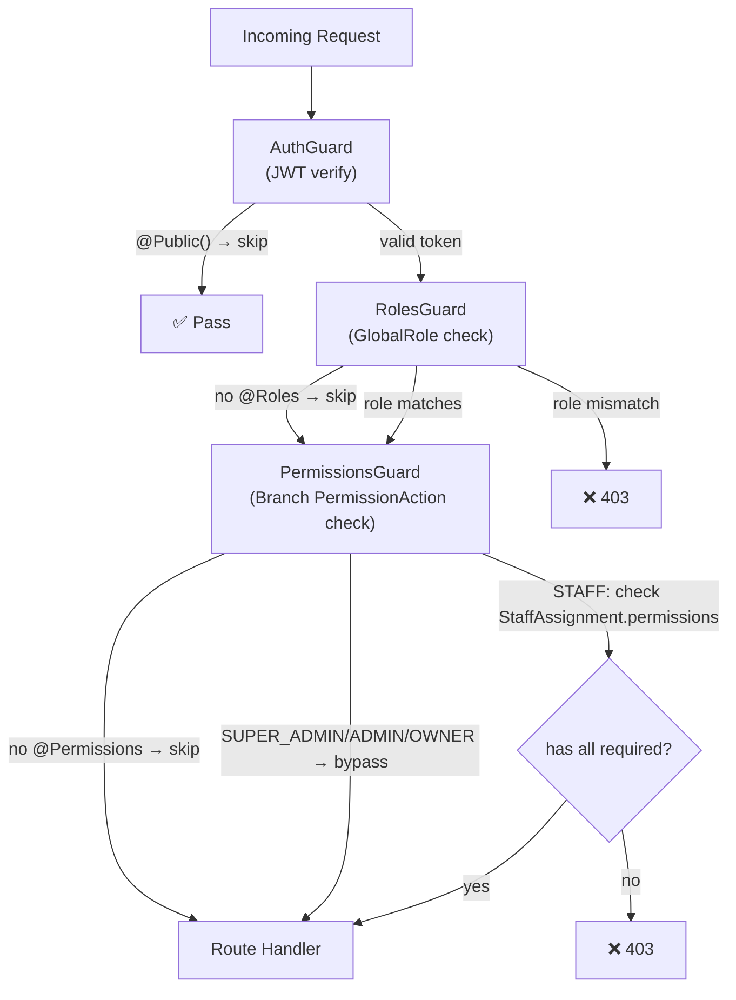
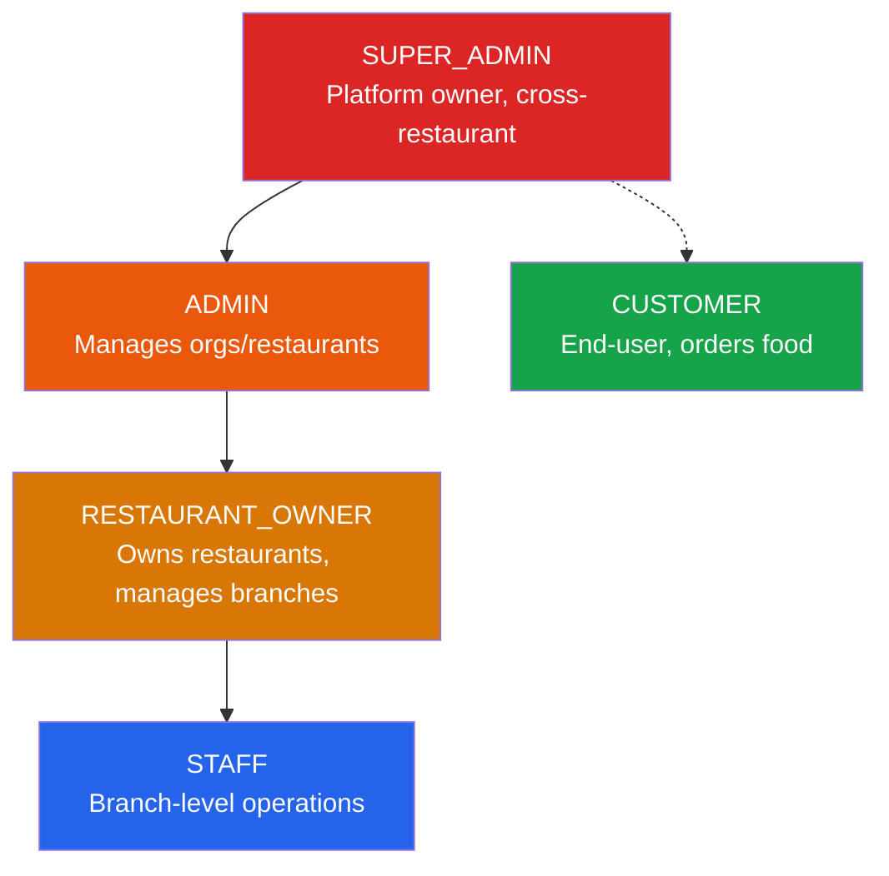
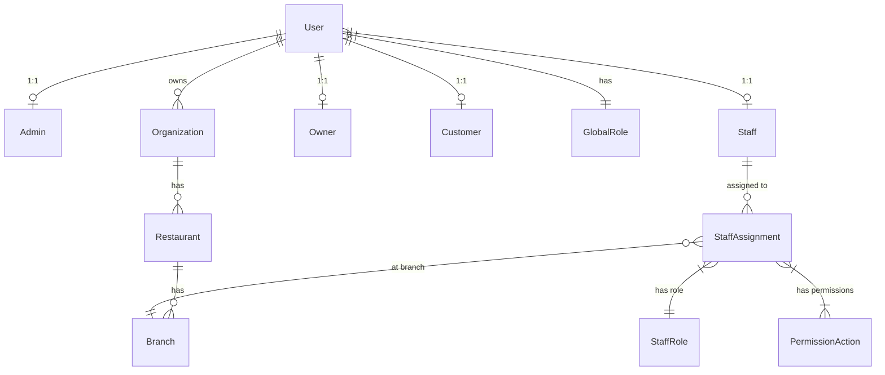
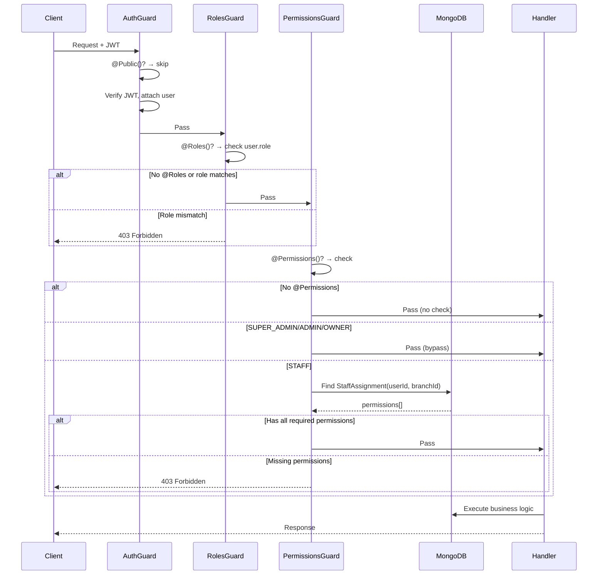

# Authentication & Role/Permission Architecture

## Tavonza AI — Restaurant Ordering & Table Management Platform

---

## 1. High-Level Overview

The system uses a **two-layer authorization model**:

| Layer | Scope | Mechanism | Where Defined |
|-------|-------|-----------|---------------|
| **Layer 1 — Global Role** | Platform-wide | `GlobalRole` enum on `User.role` | [schema.prisma](file:///home/euhan/projects/milky.server/prisma/schema.prisma#L35-L41) |
| **Layer 2 — Branch Permission** | Per-branch | `StaffRole` + `PermissionAction[]` on `StaffAssignment` | [schema.prisma](file:///home/euhan/projects/milky.server/prisma/schema.prisma#L429-L446) |



All three guards are registered as **global `APP_GUARD`s** in [app.module.ts](file:///home/euhan/projects/milky.server/src/app/app.module.ts#L83-L85), executing in order:

1. `AuthGuard` → JWT verification
2. `RolesGuard` → GlobalRole whitelist
3. `PermissionsGuard` → Branch-scoped fine-grained permissions

---

## 2. Authentication Mechanisms

### 2.1 JWT Authentication (Primary)

| Aspect | Detail |
|--------|--------|
| **Strategy** | Stateless JWT via `@nestjs/jwt` |
| **Token source** | `Authorization: Bearer <token>` header, fallback to `access_token` HttpOnly cookie |
| **Access token TTL** | 7 days |
| **Refresh token TTL** | 30 days |
| **JWT payload** | `{ id, email, role, name, avatar }` |
| **Secret** | `JWT_SECRET` from env |

> [!IMPORTANT]
> The JWT payload includes `GlobalRole` but **not** branch-level `StaffRole` or `PermissionAction[]`. Branch permissions are always fetched live from the DB by `PermissionsGuard`.

**Login flow** — [auth.service.ts](file:///home/euhan/projects/milky.server/src/modules/auth/auth.service.ts#L26-L69):
```
POST /api/v1/auth/login  →  verify email+password  →  sign JWT pair  →  set HttpOnly cookies + return tokens
```

### 2.2 Table OTP Authentication (Customer QR Flow)

| Aspect | Detail |
|--------|--------|
| **Model** | `TableAuthOtp` |
| **Purpose** | Authenticate guests scanning table QR codes |
| **OTP type** | 4-digit numeric, 10-minute expiry |
| **Configurable** | `BranchSetting.requireOtpPerGuest` — per-guest OTP vs first-guest-covers-all |

### 2.3 Password Reset OTP

| Aspect | Detail |
|--------|--------|
| **Model** | `PasswordResetOtp` |
| **Flow** | `POST /forgot-password` → email OTP → `POST /reset-password` |
| **OTP type** | 4-digit, 10-minute expiry |

### 2.4 Public Endpoints (No Auth Required)

Routes decorated with `@Public()`:
- `POST /auth/login`
- `POST /auth/register`
- `POST /auth/forgot-password`
- `POST /auth/reset-password`
- `POST /auth/confirm-email-change`

---

## 3. Role Hierarchy

### 3.1 GlobalRole (Platform-Level)



| GlobalRole | Scope | Implicit Powers |
|------------|-------|-----------------|
| `SUPER_ADMIN` | Entire platform | All operations; org/admin CRUD; bypasses all permission checks |
| `ADMIN` | Assigned organization(s) | Org/restaurant/branch management; bypasses branch permissions |
| `RESTAURANT_OWNER` | Owned restaurants | Branch/menu/table/staff management; bypasses branch permissions |
| `STAFF` | Assigned branch(es) | Operations governed by `StaffRole` + `PermissionAction[]` |
| `CUSTOMER` | Self-service | Place orders, make payments, manage own profile |

> [!NOTE]
> `SUPER_ADMIN`, `ADMIN`, and `RESTAURANT_OWNER` **automatically bypass** all `PermissionsGuard` checks — see [permissions.guard.ts L39-45](file:///home/euhan/projects/milky.server/src/modules/permissions/permissions.guard.ts#L39-L45).

### 3.2 StaffRole (Branch-Level)

Assigned per-branch via `StaffAssignment.role`:

| StaffRole | Typical Responsibilities |
|-----------|------------------------|
| `BRANCH_MANAGER` | Full branch operations, staff scheduling, reports |
| `HOST` | Seating, reservations, waitlist |
| `WAITER` | Table service, order acceptance, serving |
| `KITCHEN_STAFF` | Kitchen display, item preparation |
| `BARTENDER` | Bar display, drink preparation |
| `CASHIER` | POS, payments, settlements |

### 3.3 PermissionAction (Fine-Grained)

Stored as `PermissionAction[]` on each `StaffAssignment`:

| PermissionAction | Description |
|-----------------|-------------|
| `MANAGE_MENU` | Create/update/delete menu items and categories |
| `MANAGE_TABLES` | Create/update/delete tables, manage table layout |
| `MANAGE_STAFF` | Assign/remove staff, update assignments |
| `MANAGE_RESERVATIONS` | Create/update/cancel reservations |
| `VIEW_ORDERS` | Read-only access to orders |
| `UPDATE_ORDER_STATUS` | Accept/reject/advance order status |
| `MANAGE_PAYMENTS` | Process payments, refunds |
| `APPLY_DISCOUNTS` | Apply discount codes to orders |
| `VIEW_REPORTS` | Access dashboard/analytics |
| `MANAGE_BRANCH_SETTINGS` | Update branch configuration |

---

## 4. Per-Endpoint Access Matrix

### 4.1 Auth Module
| Endpoint | Roles | Permissions | Notes |
|----------|-------|-------------|-------|
| `POST /auth/login` | `@Public()` | — | |
| `POST /auth/register` | `@Public()` | — | Customer self-registration |
| `POST /auth/fcm-token` | ADMIN, OWNER, CUSTOMER | — | |
| `GET /auth/get-me` | Any authenticated | — | |
| `POST /auth/change-password` | Any authenticated | — | |
| `POST /auth/forgot-password` | `@Public()` | — | |
| `POST /auth/reset-password` | `@Public()` | — | |
| `POST /auth/logout` | Any authenticated | — | |
| `POST /auth/change-email-request` | Any authenticated | — | |
| `POST /auth/confirm-email-change` | `@Public()` | — | |

### 4.2 Admin Module
| Endpoint | Roles | Notes |
|----------|-------|-------|
| `POST /admins` | SUPER_ADMIN | Auto-creates organization |
| `GET /admins` | SUPER_ADMIN | |
| `GET /admins/:id` | SUPER_ADMIN | |
| `PATCH /admins/:id` | SUPER_ADMIN | |
| `PATCH /admins/:id/status` | SUPER_ADMIN | Toggle active/inactive |
| `DELETE /admins/:id` | SUPER_ADMIN | |

### 4.3 Organization & Restaurant Module
| Endpoint | Roles |
|----------|-------|
| `POST /organizations` | SUPER_ADMIN |
| `GET /organizations` | SUPER_ADMIN, ADMIN |
| `GET /organizations/:id` | SUPER_ADMIN, ADMIN |
| `PATCH /organizations/:id` | SUPER_ADMIN, ADMIN |
| `DELETE /organizations/:id` | SUPER_ADMIN |
| `POST /organizations/:orgId/restaurants` | SUPER_ADMIN, ADMIN |
| `GET /restaurants` | SUPER_ADMIN, ADMIN, OWNER |
| `PATCH /restaurants/:id` | SUPER_ADMIN, ADMIN |
| `DELETE /restaurants/:id` | SUPER_ADMIN, ADMIN |

### 4.4 Branch Module
| Endpoint | Roles |
|----------|-------|
| `POST /restaurants/:restId/branches` | SUPER_ADMIN, ADMIN, OWNER |
| `GET /branches` | SUPER_ADMIN, ADMIN, OWNER |
| `GET /branches/:id` | SUPER_ADMIN, ADMIN, OWNER |
| `PATCH /branches/:id` | SUPER_ADMIN, ADMIN, OWNER |
| `DELETE /branches/:id` | SUPER_ADMIN, ADMIN, OWNER |

### 4.5 Branch Settings
| Endpoint | Roles | Permissions |
|----------|-------|-------------|
| `GET /branches/:branchId/settings` | SUPER_ADMIN, ADMIN, OWNER | `MANAGE_BRANCH_SETTINGS` |
| `PATCH /branches/:branchId/settings` | SUPER_ADMIN, ADMIN, OWNER | `MANAGE_BRANCH_SETTINGS` |

### 4.6 Staff & Users
| Endpoint | Roles |
|----------|-------|
| `POST /users` | SUPER_ADMIN, ADMIN |
| `GET /users` | SUPER_ADMIN, ADMIN |
| `POST /branches/:branchId/staff` | SUPER_ADMIN, ADMIN, OWNER |
| `GET /branches/:branchId/staff` | SUPER_ADMIN, ADMIN, OWNER |
| `PATCH /staff-assignments/:id` | SUPER_ADMIN, ADMIN, OWNER |
| `DELETE /staff-assignments/:id` | SUPER_ADMIN, ADMIN, OWNER |

### 4.7 Menu (Categories, Items, Modifiers)
| Endpoint | Roles |
|----------|-------|
| All CRUD operations | SUPER_ADMIN, ADMIN, OWNER |

> [!WARNING]
> **Staff with `MANAGE_MENU` permission cannot access menu endpoints.** The menu controller uses only `@Roles()` without `@Permissions(MANAGE_MENU)`. This means a BRANCH_MANAGER cannot manage menu items even with the permission granted.

### 4.8 Tables & Reservations
| Endpoint | Roles |
|----------|-------|
| All CRUD operations | SUPER_ADMIN, ADMIN, OWNER |

> [!WARNING]
> Same gap — `MANAGE_TABLES` and `MANAGE_RESERVATIONS` permissions exist in the schema but are **not wired** to the table/reservation controllers.

### 4.9 Sessions (Table & Guest)
| Endpoint | Roles |
|----------|-------|
| `GET /branches/:branchId/sessions` | SA, ADMIN, OWNER, STAFF |
| `POST /tables/:tableId/sessions` | SA, ADMIN, OWNER, STAFF |
| `POST /tables/:tableId/sessions/join` | SA, ADMIN, OWNER, STAFF, CUSTOMER |
| `PATCH /table-sessions/:id` | SA, ADMIN, OWNER, STAFF |
| `PATCH /guest-sessions/:id` | SA, ADMIN, OWNER, STAFF |

### 4.10 Orders
| Endpoint | Roles |
|----------|-------|
| `POST /branches/:branchId/orders` | SA, ADMIN, OWNER, STAFF, CUSTOMER |
| `GET /branches/:branchId/orders` | SA, ADMIN, OWNER, STAFF |
| `GET /orders/:id` | SA, ADMIN, OWNER, STAFF |
| `PATCH /orders/:id/accept` | SA, ADMIN, OWNER, STAFF |
| `PATCH /orders/:id/reject` | SA, ADMIN, OWNER, STAFF |
| `PATCH /orders/:id/status` | SA, ADMIN, OWNER, STAFF |
| `PATCH /orders/:id/cancel` | SA, ADMIN, OWNER, STAFF, CUSTOMER |
| `PATCH /order-items/:id/status` | SA, ADMIN, OWNER, STAFF |
| `GET /orders/:id/status-log` | SA, ADMIN, OWNER, STAFF |

> [!WARNING]
> `VIEW_ORDERS`, `UPDATE_ORDER_STATUS` permissions exist but are **not enforced**. Any STAFF can access all order endpoints regardless of their branch permissions.

### 4.11 Payments
| Endpoint | Roles |
|----------|-------|
| `POST /payments` | SA, ADMIN, OWNER, STAFF, CUSTOMER |
| `GET /payments` | SA, ADMIN, OWNER, STAFF |
| `GET /payments/:id` | SA, ADMIN, OWNER, STAFF |
| `POST /payments/:id/refund` | SA, ADMIN, OWNER, STAFF |

### 4.12 POS, Display, Dashboard, QR Config
| Endpoint | Roles |
|----------|-------|
| All POS endpoints | SA, ADMIN, OWNER, STAFF |
| All Display endpoints | SA, ADMIN, OWNER, STAFF |
| All Dashboard endpoints | SA, ADMIN, OWNER, STAFF |
| QR generate/get | SA, ADMIN, OWNER, STAFF |
| QR settings update | SA, ADMIN, OWNER |

### 4.13 Customer
| Endpoint | Roles |
|----------|-------|
| `GET /customers` | ADMIN, OWNER, CUSTOMER |
| `GET /customers/:id` | ADMIN, OWNER, CUSTOMER |
| `PATCH /customers/:id` | ADMIN, OWNER, CUSTOMER |
| `DELETE /customers/:id` | ADMIN, OWNER, CUSTOMER |

---

## 5. Data Model Relationships



**Key design decisions:**
- A `User` has **one** `GlobalRole` (platform-wide identity)
- A `Staff` user can have **multiple** `StaffAssignment`s (one per branch)
- Each `StaffAssignment` carries both a `StaffRole` and an explicit `PermissionAction[]` array
- `StaffRole` is informational/organizational; actual access control is driven by `PermissionAction[]`

---

## 6. Guard Implementation Details

### AuthGuard
- **File**: [auth.guard.ts](file:///home/euhan/projects/milky.server/src/modules/auth/auth.guard.ts)
- Checks `@Public()` decorator → skips if present
- Extracts JWT from `Authorization` header or `access_token` cookie
- Verifies token, attaches decoded payload to `request.user`

### RolesGuard
- **File**: [roles.guard.ts](file:///home/euhan/projects/milky.server/src/modules/roles/roles.guard.ts)
- Reads `@Roles(...)` metadata
- If no roles specified → allows all
- Checks `request.user.role` against the whitelist

### PermissionsGuard
- **File**: [permissions.guard.ts](file:///home/euhan/projects/milky.server/src/modules/permissions/permissions.guard.ts)
- Reads `@Permissions(...)` metadata
- **Auto-bypasses** for `SUPER_ADMIN`, `ADMIN`, `RESTAURANT_OWNER`
- For `STAFF`/`CUSTOMER`: resolves `branchId` from params/body/query
- Fetches active `StaffAssignment` from DB
- Checks ALL required permissions are present (logical AND)

---

## 7. Identified Gaps & Issues

> [!CAUTION]
> ### Critical: 8 of 10 PermissionActions Are Unused
> Only `MANAGE_BRANCH_SETTINGS` is wired to a controller. The remaining 9 permissions exist in the schema but have **zero enforcement**:
> 
> | Permission | Should Protect | Currently Used? |
> |-----------|---------------|-----------------|
> | `MANAGE_MENU` | Menu CRUD | ❌ |
> | `MANAGE_TABLES` | Table CRUD | ❌ |
> | `MANAGE_STAFF` | Staff assignments | ❌ |
> | `MANAGE_RESERVATIONS` | Reservation CRUD | ❌ |
> | `VIEW_ORDERS` | Order listing | ❌ |
> | `UPDATE_ORDER_STATUS` | Accept/reject/status | ❌ |
> | `MANAGE_PAYMENTS` | Payment/refund | ❌ |
> | `APPLY_DISCOUNTS` | Discount application | ❌ |
> | `VIEW_REPORTS` | Dashboard analytics | ❌ |
> | `MANAGE_BRANCH_SETTINGS` | Branch config | ✅ |

> [!WARNING]
> ### No Tenant Isolation
> - **STAFF can access any branch's data.** The `RolesGuard` only checks `GlobalRole`, not whether the staff member belongs to the branch they're querying. The `PermissionsGuard` only runs when `@Permissions()` is present, which is almost never used.
> - **RESTAURANT_OWNER** can access any restaurant's data, not just their own.
> - **ADMIN** can access any organization's data, not just the one they own.

> [!WARNING]
> ### StaffRole Is Not Enforced
> `StaffRole` (BRANCH_MANAGER, WAITER, HOST, etc.) is stored on `StaffAssignment` but **never checked** by any guard. All authorization is done via `GlobalRole` + `PermissionAction[]`. The `StaffRole` is purely informational.

> [!NOTE]
> ### Other Observations
> - **No refresh token rotation** — refresh tokens are issued but there's no refresh endpoint
> - **No token blacklist** — logout clears cookies but doesn't invalidate the JWT server-side
> - **Passport strategies are commented out** — both `local.strategy.ts` and `oidc.strategy.ts` are fully commented
> - **`BranchSetting.backupAccepterRoles`** stores `StaffRole[]` for backup order acceptance but has no guard integration
> - **WebSocket auth** is in `socket.io.service.ts` (33KB) — not audited here

---

## 8. Summary Flow Diagram


